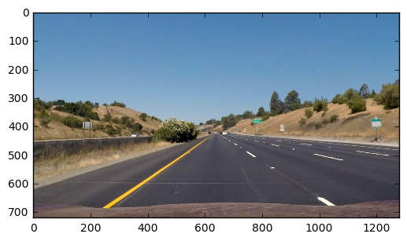

# Project 4 - Advanced Lane finding Project


This is a writeup for the Project 4 - Advanced Lane finding Project. The intention here is to explain the code used to accomplish the task of detecting lanes and plotting non-linear lines to mark the lanes detected.

Top Level:
-Calibrate Camera using ChessBoard Images
-Get distortion coefficents and distortion matrix
-Perspective transform a selected region of an image
-Filter and extract binary images when lanes become apparent
-Plot histogram of pixel counts and select peaks as lines
-Do the above on the entire image by splitting the image into rows and sweeping across for peaks
-Plot lines by extracting the peaks as points
-Fit a 2nd order line
-Plot the line
-Revert Perspective transform
-Write Radius fo Curvature calculations
### Camera Calibration
Camera calibration is handeled by camera_calibration.py. It begins with creating empty storage variables. Lets discuss terminology, we start with Corners and Objectpoints, Corners are image point which are 2D and Object points are 3D with z=0. Corners are mapped to the Object Points. Object points are known image points which are fit to these known points. 

OpenCV makes this process easy with cv2.findChessboardCorners(gray, (nx, ny), None), this finds the corners in the image. Then corners can be drawn to visulize the result. The end game here is to undistort the image, OpenCV is leveraged here once more with the cv2.calibrateCamera(objpoints, imgpoints, gray.shape[::-1], None, None), which return the distortion coefficents and the camera matrix. 

Finally, the image is distorted by using the distortion coefficients and camera matrix. The OpenCV function used for this is cv2.undistort(img, mtx, dist, None, mtx).

Here is what it looks like:

```python
orignal = mpimg.imread('./camera_cal/calibration1.jpg')
undistorted = mpimg.imread('./chessboard_undist/output0.png')

fig = plt.figure()
plt.subplot(221)
plt.imshow(orignal)
plt.subplot(222)
plt.imshow(undistorted)
```


    <matplotlib.image.AxesImage at 0x1fd13b0f5f8>


### Pipleline for Single image
Lets looks at a clean image:

```python
cimage = mpimg.imread(timgs_dir+timgs[0])
plt.imshow(cimage)
```


    <matplotlib.image.AxesImage at 0x1fd13ed3eb8>




Gradient in the X direction, HSV, HLS, Directional Gradient were used to extract binary images. This is done with the binary_img() function. In general images were converted to grayscale, filtered, scaled to 8bit, and finally binary images were extracted based on min max threshold values defined by me. A simple Widgets GUI was employed to make the process easier.

```python
bimage = binary_img(cimage,20,1,0,0.5,100,200)
plt.imshow(bimage, cmap='gray')
```


    <matplotlib.image.AxesImage at 0x1fd13f4a5f8>


Next, the image is warped using the binary_warp() function. This is done by selecting a percentage controlled section of the image and transforming the perscpective to focus entirely on the region of interest. The following code defines the region of interest, here "src" represent points from the orignal image and "dst" represent where the points will be.


    # Eastblish percentage of area of interest
    bot_width = 0.78
    mid_width = 0.08
    height_pct  = 0.62
    bottom_trim = 0.935
    offset = 100
    
    cnst_pct = 0.51
    
    # Source and destination points for the 
    img_size =  image.shape[1],image.shape[0]
    src  = np.float32([[  image.shape[1]*(cnst_pct-mid_width/2), image.shape[0]*height_pct],\
                       [  image.shape[1]*(cnst_pct+mid_width/2), image.shape[0]*height_pct],\
                       [  image.shape[1]*(cnst_pct-bot_width/2), image.shape[0]*bottom_trim],\
                       [  image.shape[1]*(cnst_pct+bot_width/2), image.shape[0]*bottom_trim] ])

    dst = np.float32([[offset, 0],\
                      [ img_size[0]-offset, 0],\
                      [offset,  img_size[1]],\
                      [img_size[0]-offset, img_size[1]]])


```python
binary_warped = binary_warp(cimage, mtx, dist)
```


Lines are drawn at the points/peaks detected, below is a visualization. As shown in the image lines are drawn by 9 windows on each side. This were manually assigned to search for peaks in pixel count.
first_search(), visualize_first_search() are the two functions used for this.

```python
left_fit, right_fit, left_lane_inds, right_lane_inds, out_img, nonzero, nonzerox, nonzeroy = first_search(binary_warped)
visualize_first_search(out_img, nonzerox, nonzeroy)
```


lanes() is the main function which complies all function. It also includes the calculation for lane curvature. A general second order polynomial is used where the coefficents are defined by the points detected and a arbitrary rquadratic coefficent.                                  
    quadratic_coeff = 3e-4 # arbitrary quadratic coefficient
    leftx = np.array([left_fitx[-1] + (y**2)*quadratic_coeff + np.random.randint(-50, high=51) for y in ploty])
    rightx = np.array([right_fitx[-1] + (y**2)*quadratic_coeff + np.random.randint(-50, high=51) for y in ploty])


```python
img= lanes(cimage)
plt.imshow(img)
```


    <matplotlib.image.AxesImage at 0x1fd17fe23c8>


### Discussion
The Project was guided by lessons, this gave me a good top level view of the project and a very clear guide on some of the challenging aspects. The code as is will fail should the road be rough and some white patches exist near lanes. The detection relies on finding those hot spots and too many of those near lanes will lead to problems. In snow, this code will fail.

Improvement would be introducing a smoothing factor, where the plotting values are averages from previous frames with some bias towards the current one. Overall I will introduce Classes, the improvement tasks will be a lot easier to handle with an OOP methodology vs. simply writing a individual functions. Storing values from previous frames will be easy in a variable local to a class as this can't be done with functions without introducing a mess of loops. 

Overall the Project was interesting and gave me detailed exposure to techniques in lane detection. 
